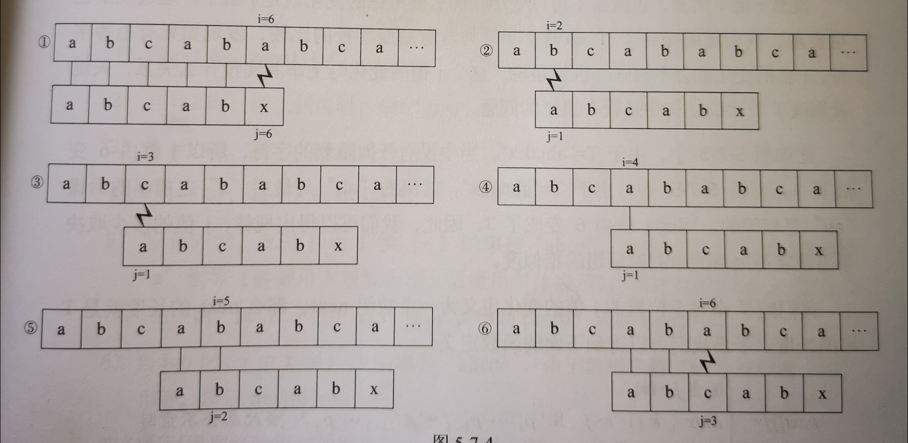
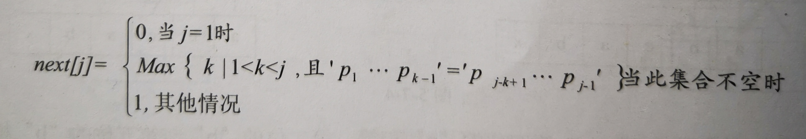

## KMP模式匹配算法

[toc]

### KMP算法原理

---

假设主串S="abcababca"，要匹配的子串T="abcabx"

* 朴素的模式匹配过程

  

  子串T中，**ab**c**ab**，有过程中，第2、3、4、5步是可以省略的。

### next数组值推导 

---

***--- 最长公共前后缀***：https://www.bilibili.com/video/BV1Px411z7Yo?from=search&seid=4210400230343084513

给T串定义一个对应的数组**next**，长度为T串的长度。定义如下：

	> 1. 模式串从下标1开始，下标0作为“哨兵”
	> 2. j > 2 时，sub-string(1, j-1)中对称的字符子串的字符个数 + 1 = next[***j***]
	> 3. 公共前后缀为 **n**，主串当前位置与模式串 ***第n+1号位*** 进行比较

| j                  | 1    | 3    | 3    | 4    | 5    | 6     |
| ------------------ | ---- | ---- | ---- | ---- | ---- | ----- |
| 模式串T            | a    | b    | c    | d    | e    | x     |
| sub-string(1, j-1) | \    | a    | ab   | abc  | abcd | abcde |
| next[j]            | 0    | 1    | 1    | 1    | 1    | 1     |

**模式串 T = "ababaaaba"**

| j                  | 1    | 2    | 3    | 4                | 5                              | 6                  | 7                   | 8                    | 9                     |
| ------------------ | ---- | ---- | ---- | ---------------- | ------------------------------ | ------------------ | ------------------- | -------------------- | --------------------- |
| 模式串 T           | a    | b    | a    | b                | a                              | a                  | a                   | b                    | a                     |
| sub-string(1, j-1) | \    | a    | ab   | ***<u>a</u>***ba | ***<u>ab</u>******<u>ab</u>*** | ***<u>aba</u>***ba | ***<u>a</u>***babaa | ***<u>a</u>***babaaa | ***<u>ab</u>***abaaab |
|                    | 0    | 1    | 1    | 2                | 3                              | 4                  | 2                   | 2                    | 3                     |

### KMP算法实现

---

