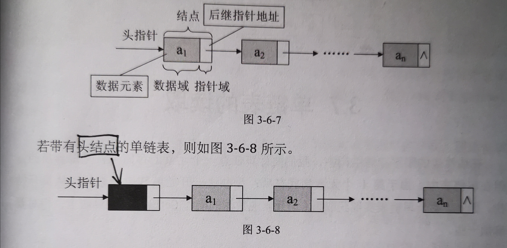

# LinkList --- 链表

***线性表的<font color=red>链式存储结构</font>*** 

**头指针**：链表指向第一个结点的指针，若链表有头结点，则是指向头结点的指针

**头结点**：为操作方便而设立，放在第一个元素的结点之前，其数据域一般无意义



| 优点                                                         | 缺点                                                         |
| :----------------------------------------------------------- | ------------------------------------------------------------ |
| 1、无须物理上连续的存储空间，减少空间“碎片”<br />2、链表不需要预分配存储空间，只要有就可分配，元素个数不受限制<br />3、指定位置，插入和删除操作时间复杂度O(1) | 1、为表示表中元素的逻辑关系，须增加额外的存储空间<br />2、单链表只能从表头开始查询，时间复杂度O(n)<br /> |

### 复杂度

---

| 操作 | 时间复杂度 | 空间复杂的 |
| :--: | :--------: | :--------: |
| 插入 |    O(1)    |            |
| 删除 |    O(1)    |            |
| 查找 |    O(n)    |            |

### 单向链表结构

----

```c
/* 单链表结构体 */
typedef struct Node
{
	ElemType data;		//数据域
	struct Node *next;	//指针域
}Node;
typedef struct Node *LinkList;
```

### 单向链表基础操作

---

```c
/* 初始化链式线性表 */
Status InitList(LinkList *L) 

/* 初始条件：链式线性表L已存在。操作结果：若L为空表，则返回TRUE，否则返回FALSE */
Status ListEmpty(LinkList L)

/* 初始条件：链式线性表L已存在。操作结果：将L重置为空表 */
Status ClearList(LinkList *L)

/* 初始条件：链式线性表L已存在。操作结果：返回L中数据元素个数 */
int ListLength(LinkList L)

/* 初始条件：链式线性表L已存在，1≤i≤ListLength(L) */
/* 操作结果：用e返回L中第i个数据元素的值 */
Status GetElem(LinkList L,int i,ElemType *e)

/* 初始条件：链式线性表L已存在 */
/* 操作结果：返回L中第1个与e满足关系的数据元素的位序。 */
/* 若这样的数据元素不存在，则返回值为0 */
int LocateElem(LinkList L,ElemType e)

/* 初始条件：链式线性表L已存在,1≤i≤ListLength(L)， */
/* 操作结果：在L中第i个位置之前插入新的数据元素e，L的长度加1 */
Status ListInsert(LinkList *L,int i,ElemType e)
    
/* 初始条件：链式线性表L已存在，1≤i≤ListLength(L) */
/* 操作结果：删除L的第i个数据元素，并用e返回其值，L的长度减1 */
Status ListDelete(LinkList *L,int i,ElemType *e) 

/* 初始条件：链式线性表L已存在 */
/* 操作结果：依次对L的每个数据元素输出 */
Status ListTraverse(LinkList L)
    
/*  随机产生n个元素的值，建立带表头结点的单链线性表L（头插法） */
void CreateListHead(LinkList *L, int n)

/*  随机产生n个元素的值，建立带表头结点的单链线性表L（尾插法） */
void CreateListTail(LinkList *L, int n) 
```

