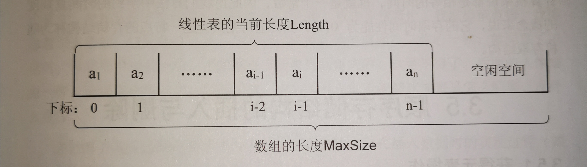

## List --- 顺序表

[toc]

线性表的***<font color=red>顺序存储结构</font>*** ：线性表的顺序存储结构指的是用一段**地址连续的存储单元**依次存储线性表的数据元素。



| 优点                                                         | 缺点                                                         |
| :----------------------------------------------------------- | ------------------------------------------------------------ |
| 1、无须为表示表中元素之间的逻辑关系而增加额外存储空间<br />2、快速存取表中任一位置元素 | 1、插入和删除操作需要移动大量元素<br />2、线性表长度变化较大时，难以确定存储空间容量<br />3、存储空间“碎片” |

### 复杂度

---

| 操作 | 时间复杂度 | 空间复杂的 |
| :--: | :--------: | :--------: |
| 插入 |    O(n)    |            |
| 删除 |    O(n)    |            |
| 查找 |    O(1)    |            |

### 顺序表结构

---

```c
typedef struct
{
	ElemType data[MAXSIZE];        /* 数组，存储数据元素 */
	int length;                                /* 线性表当前长度 */
}SqList;
```

### 顺序表基础操作

---

```c
/* 初始化顺序线性表 */
Status InitList(SqList *L) 

/* 初始条件：顺序线性表L已存在。操作结果：若L为空表，则返回TRUE，否则返回FALSE */
Status ListEmpty(SqList L)

/* 初始条件：顺序线性表L已存在。操作结果：将L重置为空表 */
Status ClearList(SqList *L)

/* 初始条件：顺序线性表L已存在。操作结果：返回L中数据元素个数 */
int ListLength(SqList L)

/* 初始条件：顺序线性表L已存在，1≤i≤ListLength(L) */
/* 操作结果：用e返回L中第i个数据元素的值,注意i是指位置，第1个位置的数组是从0开始 */
Status GetElem(SqList L,int i,ElemType *e)

/* 初始条件：顺序线性表L已存在 */
/* 操作结果：返回L中第1个与e满足关系的数据元素的位序。 */
/* 若这样的数据元素不存在，则返回值为0 */
int LocateElem(SqList L,ElemType e)

/* 初始条件：顺序线性表L已存在,1≤i≤ListLength(L)， */
/* 操作结果：在L中第i个位置之前插入新的数据元素e，L的长度加1 */
Status ListInsert(SqList *L,int i,ElemType e)

/* 初始条件：顺序线性表L已存在，1≤i≤ListLength(L) */
/* 操作结果：删除L的第i个数据元素，并用e返回其值，L的长度减1 */
Status ListDelete(SqList *L,int i,ElemType *e) 

/* 初始条件：顺序线性表L已存在 */
/* 操作结果：依次对L的每个数据元素输出 */
Status ListTraverse(SqList L)

void unionL(SqList *La,SqList Lb)
```
