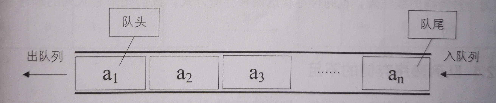

## Queue --- 队列

[toc]

***队列***是只允许在一端进行插入操作，而在另一端进行删除操作的线性表。是一种先进先出（***First In First Out***，***FIFO***）的线性表。

**队头**：允许插入的一端

**队尾**：允许删除的一端



### 队列分类

---

 * **顺序队列**

 * **循环队列**

   头尾相连的顺序存储结构称为循环队列。

 * **链式队列**

   链式存储结构，就是线性表的单链表，只不过只能尾进头出。

### 队列结构

---

```c
/* 循环队列的顺序存储结构 */
typedef struct
{
	QElemType data[MAXSIZE];
	int front;    	/* 头指针 */
	int rear;		/* 尾指针，若队列不空，指向队列尾元素的下一个位置 */
}SqQueue;

/* 队列的链式存储结构 */
typedef struct QNode	/* 结点结构 */
{
   QElemType data;
   struct QNode *next;
}QNode,*QueuePtr;

typedef struct			/* 队列的链表结构 */
{
   QueuePtr front,rear; /* 队头、队尾指针 */
}LinkQueue;
```

### 队列基本操作

---

```c
/* 初始化一个空队列Q */
Status InitQueue(SqQueue *Q)

/* 将Q清为空队列 */
Status ClearQueue(SqQueue *Q)

/* 若队列Q为空队列,则返回TRUE,否则返回FALSE */
Status QueueEmpty(SqQueue Q)

/* 返回Q的元素个数，也就是队列的当前长度 */
int QueueLength(SqQueue Q)

/* 若队列不空,则用e返回Q的队头元素,并返回OK,否则返回ERROR */
Status GetHead(SqQueue Q,QElemType *e)

/* 若队列未满，则插入元素e为Q新的队尾元素 */
Status EnQueue(SqQueue *Q,QElemType e)

/* 若队列不空，则删除Q中队头元素，用e返回其值 */
Status DeQueue(SqQueue *Q,QElemType *e)

/* 从队头到队尾依次对队列Q中每个元素输出 */
Status QueueTraverse(SqQueue Q)
```

