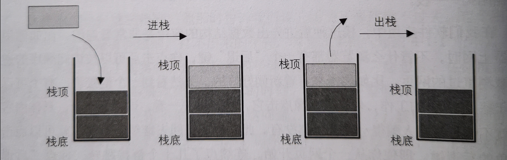
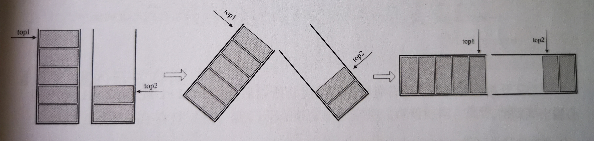

## Stack --- 栈

[toc]

**栈**是限定仅在**表尾**进行插入和删除的**线性表**。又称为后进先出（**Last In First Out**，***LIFO***）的线性表。



### 复杂度

---

| 操作 | 时间复杂度 | 空间复杂的 |
| :--: | :--------: | :--------: |
| 入栈 |    O(1)    |            |
| 出栈 |    O(1)    |            |

### 分类

---

 * #### 顺序栈

   栈的顺序存储，是线性表顺序存储的简化。

 * #### 共享栈

   两栈共享空间，顺序栈必须事先确定数组存储空间大小，小了扩展麻烦，大了浪费空间，共享栈一定程度解决该问题。

   

 * #### 链栈

   栈的链式存储结构。

### 栈结构

---

```c
/* 顺序栈结构 */
typedef struct
{
        SElemType data[MAXSIZE];
        int top; /* 用于栈顶指针 */
}SqStack;

/* 两栈共享空间结构 */
typedef struct 
{
        SElemType data[MAXSIZE];
        int top1;	/* 栈1栈顶指针 */
        int top2;	/* 栈2栈顶指针 */
}SqDoubleStack;

/* 链栈结构 */
typedef struct StackNode
{
        SElemType data;
        struct StackNode *next;
}StackNode,*LinkStackPtr;

typedef struct
{
        LinkStackPtr top;
        int count;
}LinkStack;
```

### 栈基础操作

---

```c
/*  构造一个空栈S */
Status InitStack(Stack *S)

/* 把S置为空栈 */
Status ClearStack(Stack *S)

/* 若栈S为空栈，则返回TRUE，否则返回FALSE */
Status StackEmpty(Stack S)

/* 返回S的元素个数，即栈的长度 */
int StackLength(Stack S)

/* 若栈不空，则用e返回S的栈顶元素，并返回OK；否则返回ERROR */
Status GetTop(Stack S,SElemType *e)

/* 插入元素e为新的栈顶元素 */
Status Push(Stack *S,SElemType e)

/* 若栈不空，则删除S的栈顶元素，用e返回其值，并返回OK；否则返回ERROR */
Status Pop(Stack *S,SElemType *e)

Status StackTraverse(Stack S)
```

### 栈的应用

---

* #### 递归

  ***斐波拉契数列***

* #### 四则运算表达式求值

  * ***后缀（逆波兰，RPN）表达式求值***
    1. 从左到右遍历后缀表达式
    2. 遇到**数字**，进栈
    3. 遇到**符号**，栈顶两数字出栈做运算，运算结果进栈

  

  * ***中缀表达式*** 转 ***后缀表达式***

    1. 从左到右遍历中缀表达式
    2. 若是**数字**，输出
    3. 若是**符号**，判断与栈顶符号优先级
       1. 若是 **')'** ，栈顶元素依次**出栈**，直到与 **'('** 匹配（括号不输出）
       2. 优先级**不高于**栈顶符号，栈顶元素**出栈**并**输出**，再与新栈顶符号比较
       3. 优先级**高于**栈顶符号，**入栈**

    