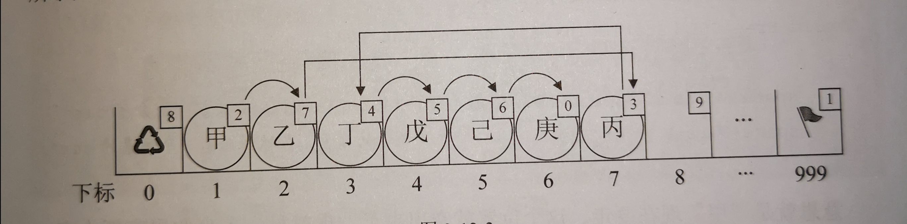

## StaticLinkList --- 静态链表

[toc]

用 ***<font color=red>数组</font>*** 描述的***链表***叫做静态链表。 


***数组 = 元素链表 + 备用链表*** ，逻辑上是 ***循环链表结构*** 如下示例：

元素链表(下标)：1-->2-->7-->3-->4-->5-->6(-->0)

备用链表(下标)：(0-->)8-->9-->......-->999(-->1)



### 静态链表结构

---

```c
/* 线性表的静态链表存储结构 */
typedef struct 
{
    ElemType data;
    int cur;  /* 游标(Cursor) ，为0时表示无指向 */
} Component,StaticLinkList[MAXSIZE];
```

### 静态链表基础操作

---

```c
/* 将一维数组space中各分量链成一个备用链表，space[0].cur为头指针，"0"表示空指针 */
Status InitList(StaticLinkList space) 

/* 若备用空间链表非空，则返回分配的结点下标，否则返回0 */
int Malloc_SSL(StaticLinkList space) 

/*  将下标为k的空闲结点回收到备用链表 */
void Free_SSL(StaticLinkList space, int k) 

/* 初始条件：静态链表L已存在。操作结果：返回L中数据元素个数 */
int ListLength(StaticLinkList L)

/*  在L中第i个元素之前插入新的数据元素e   */
Status ListInsert(StaticLinkList L, int i, ElemType e)

/*  删除在L中第i个数据元素   */
Status ListDelete(StaticLinkList L, int i)  

/* 遍历静态链表L */
Status ListTraverse(StaticLinkList L)
```

